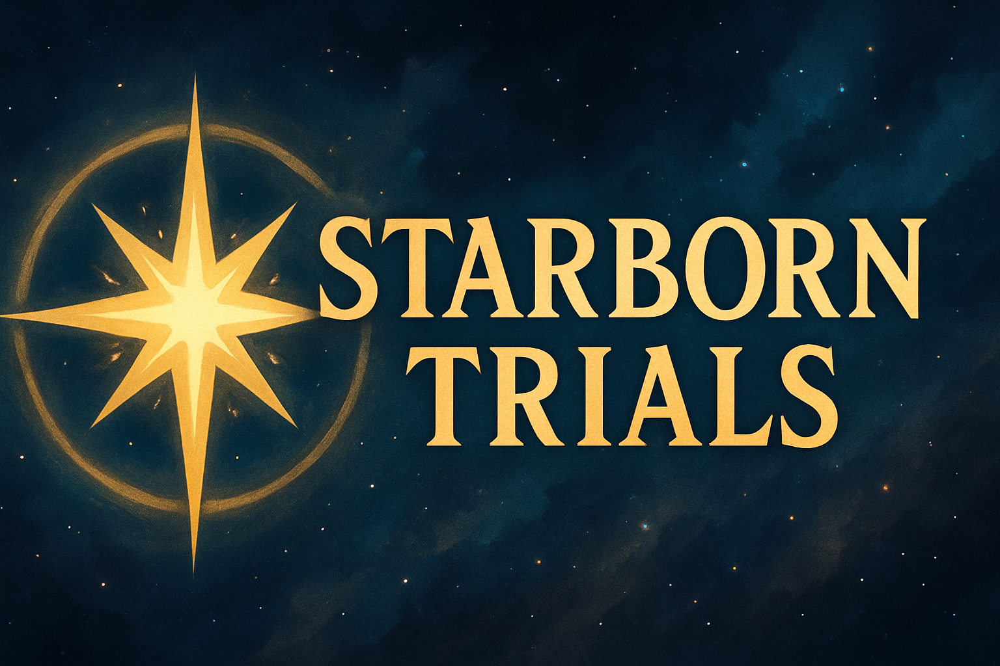

### Overview
{: .no_toc .fs-9 }

This document makes up the <i>Starborn Trials Game Design Document</i> which is the game prototype design used to inform implementation strategies for the architecture of Peligro Labs' [AetherCore](https://github.com/peligrolabs/AetherCore) game framework.
{: .fs-6 .fw-300 }

    

<!-- [Purpose](./purpose.html){: .btn .btn-primary .fs-5 .mb-4 .mb-md-0 .mr-2 } [Architecture](./architecture.html){: .btn .fs-5 .mb-4 .mb-md-0 } -->

### Table of Contents
{: .no_toc .text-delta }

* TOC
{:toc }

---

### 1. Purpose of the Prototype

To begin construction of the AetherCore Game Framework, designed to power Quest for the Morningstar, Trinity Fighters, Cyber Surfers, and future titles by:
- Establishing core modular systems
- Testing plug-in integration (BeeHave, Dialogue)
- Proving architectural scalability for MMO-lite infrastructure
- Serving as an “Initiation Game” that captures mythos and mechanics

---

### 2. Genre & Core Loop

<b>Genre</b>: 2D top-down action RPG 
<b>Loop</b>: Explore → Fight → Speak → Grow → Traverse
- Unlock secrets of a single World-Server Seed Map
- Combat mythic beasts, uncover relics, dialogue with spirit-NPCs
- Receive temporary “Blessings of the Aether” that alter combat/play
- Reach the Ember Chamber, survive the Trial

---

### 3. Core Systems for Prototype

| System  | Details |
| ------------- | ------------- |
| Day / Night System  | Influences ambient creatures, combat difficulty, available quests  |
| World Zoning (Octograph)  | World split into 8 navigable regions—each zone with unique traits  |
| Enterable Buildings  | Scene transitions with persistence  |
| Open World Map  | 2D tile-based with procedural map seeded per World-Server  |
| World-Server Seed Logic  | Each server runs a persistent, procedurally-generated map until a scheduled “apocalypse”  |
| Combat System  | Combo- and dodge-heavy; spiritual affinities; inspiration from Dragalia Lost & Genshin Impact  |
| RPG Mechanics  | Ability loadouts, gear upgrades, stat growth (Xenoblade/Maple Story influence)  |
| Dialogue System  | Branching, emotion-tagged NPC interactions using a chosen plugin  |
| AI (BeeHave Plugin)  | For both enemies and NPC behavior trees  |
| UI & Inventory Framework  | Modular UI skin; items, blessings, and relic management  |

---

### 4. Network Infrastructure

| Layer  | Tech Stack |
| ------------- | ------------- |
| Lobby Server  | .NET Core / Rust / Go  |
| Lobby Client  | Godot (preferred) or React Native  |
| Game Server  | Godot (preferred) or .NET Core / Rust / Go  |
| Game Client  | Godot  |

---

Copyright &copy; 2025 [Peligro Labs, LLC](https://peligrolabs.com/).